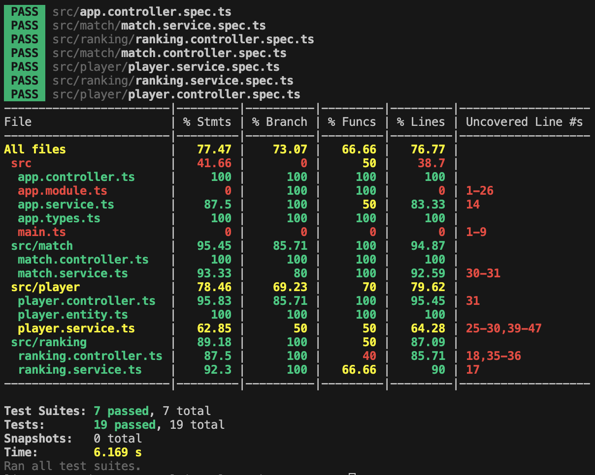

TP Développement avancé
=======================
Titouan COULON

## Présentation
Ce projet est un serveur de classement ELO en temps réel. Le client front était déja fourni et nous devions réaliser l'api backend en NestJS pour permettre au front de fonctionner.

## Installation
Pour installer le projet, il faut tout d'abord avoir installer PNPM, ensuite il suffit de lancer la commande `pnpm install` pour installer les dépendances.

## Utilisation
Pour lancer le client front, il faut lancer la commande `pnpm run apps:client:dev` et pour lancer le serveur, il faut lancer la commande `pnpm run apps:server:dev`. (dans deux terminaux différents).

Le front est accessible à l'adresse `http://localhost:3000` et le back est accessible à l'adresse `http://localhost:8080`. 

Une bd très basique est utilisée et stockée dans le fichier `db` à la racine du backend. Elle contient ces données :
```json
[{"id":"player1","rank":72},{"id":"player3","rank":0},{"id":"player5","rank":0},{"id":"player6","rank":0},{"id":"player7","rank":0},{"id":"player9","rank":0},{"id":"player10","rank":0},{"id":"player4","rank":-15},{"id":"player8","rank":-17},{"id":"player2","rank":-40}]
```

## Fonctionnalités
Le front permet de voir les joueurs et leurs scores, d'ajouter des joueurs, de simuler des matchs et de voir les resultats actualisés en temps réel.
L'API permet ces fonctionnalités mais quelques autres choses qui ne sont pas utilisées dans le front : modifier, supprimer un joueur et voir un joueur unique.
L'API est documentée avec Swagger et est accessible à l'adresse `http://localhost:3001` en executant la commande `apps:api-mock:start`.

### Details
Les interfaces et types utilisés par l'API sont présents dans (app.types.ts)[src/app.types.ts], ils representent les données manipulées par l'API.
Les controleurs sont présents dans le dossier correspondant à leur route, ranking.controller -> /ranking & /ranking/events, player.controller -> POST /player, DELETE /player, GET /player/:id, etc. Ils ne sont chargés que de la mise en forme des données et de l'appel aux services.
Les services accompagnent leur controleur et realisent les actions demandées par le controleur. Ils communiquent entre eux via l'eventemitter (EventEmitter2 de NestJS) herité de app.service.ts.
Enfin une unique classe de données est utilisée pour stocker les joueurs et leur score, elle est présente dans player.entity.ts et est ensuite mappée en mémoire dans player.service.ts.

## Tests
Pour lancer les tests, il suffit de lancer la commande `pnpm run apps:server:test` à la racine du projet. Il y a également des tests e2e qui testent l'API en entier, pour les lancer, il faut lancer la commande `pnpm run apps:server:test:e2e` ainsi que des tests de couverture de code, pour les lancer, il faut lancer la commande `pnpm run apps:server:test:cov`.

Les tests accompagnent leur fichier source et sont organisés de la même manière. Les tests unitaires sont présents dans le fichier .spec.ts correspondant au fichier source et les tests e2e sont présents dans le dossier `test`.



L'API est très maintenable et scalable, elle est bien structurée en modules, controleurs, services, ... et les tests sont complets. Elle est également bien documentée et facile à utiliser.
Le seul point négatif est que l'API n'est pas complètement utilisée par le front, il y a des fonctionnalités qui sont inutiles pour l'instant.